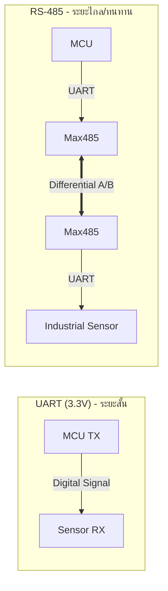

# 🔌 Serial Protocols: Chip-to-Chip & Industrial

> การเขียนโค้ดเพื่ออ่านค่า Sensor ต้องรู้ว่ามันพูดภาษาอะไร ถ้าตั้งค่า Baud rate ผิด หรือต่อสายสลับ ข้อมูลจะกลายเป็นภาษาต่างดาวทันที

---

## 1. On-board Protocols (ระยะใกล้/ในบอร์ด)

ใช้เชื่อมต่อ MCU กับ Sensor หรือหน้าจอ

### 1.1 UART (Universal Asynchronous Receiver-Transmitter)
* **สาย:** 2 เส้น (TX, RX)
* **ลักษณะ:** ไม่ต้องมีสัญญาณนาฬิกา (Asynchronous) ต้องตกลงความเร็ว (Baud rate) ให้ตรงกันก่อน
* **การใช้:** Debug ผ่าน USB, ต่อ GPS, ต่อ module WiFi เก่าๆ

### 1.2 I2C (Inter-Integrated Circuit)
* **สาย:** 2 เส้น (SDA=Data, SCL=Clock)
* **ลักษณะ:** มี Master/Slave อุปกรณ์ทุกตัวมี **Address** (เช่น 0x27) ต่อพ่วงกันได้หลายตัวในสายคู่เดียว
* **การใช้:** เซนเซอร์ส่วนใหญ่ (Temp, Humid, Gyro), จอ OLED เล็กๆ

### 1.3 SPI (Serial Peripheral Interface)
* **สาย:** 4 เส้น (MOSI, MISO, SCK, CS)
* **ลักษณะ:** เร็วมาก (Full Duplex)
* **การใช้:** จอ LCD สี, SD Card Reader, Ethernet Module

---

## 2. Industrial Protocols (ระยะไกล/ทนทาน)

เมื่อต้องลากสายยาวเกิน 1 เมตร หรือเดินสายผ่านเครื่องจักร

### 2.1 RS-485 (The Industrial Standard)
* **Hardware:** ใช้สายคู่ตีเกลียว (Twisted Pair A/B) ส่งสัญญาณแบบความต่างศักย์ (Differential)
    * *ข้อดี:* ลากสายได้ไกล 1.2 km ทนสัญญาณรบกวนสูงมาก
* **Software:** มักใช้คู่กับ **Modbus RTU Protocol**
    * เป็นภาษามาตรฐานที่ PLC และ Sensor อุตสาหกรรมใช้คุยกัน

### Diagram: UART vs RS-485

---

[🔙 กลับสู่หน้า Communication](./README.md)

