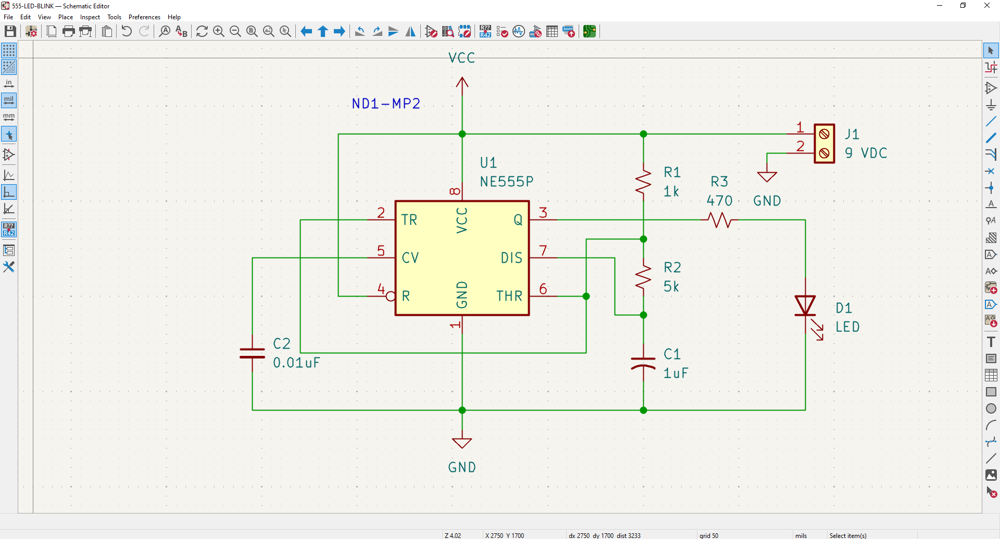
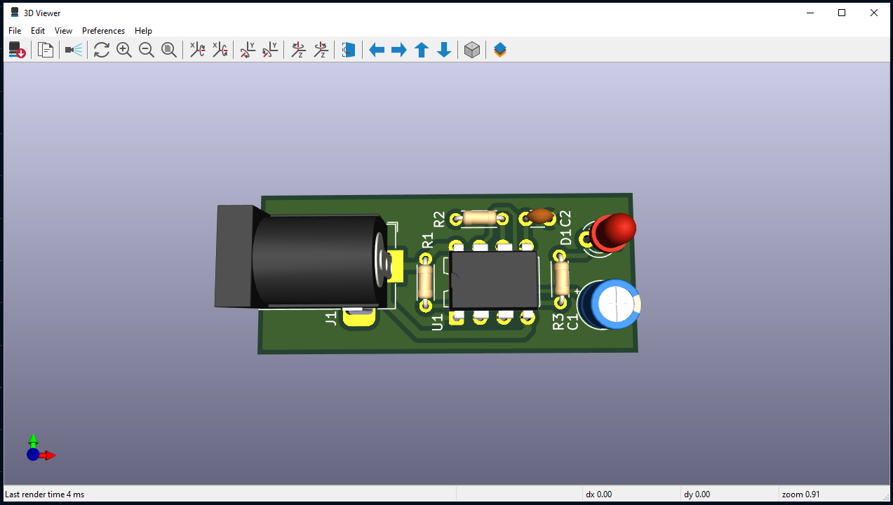

# 📐 PCB Design Basics (with KiCad)

> การต่อวงจรบน Breadboard (โฟโต้บอร์ด) มีสัญญาณรบกวนสูงและสายหลุดง่าย การทำโปรดักส์จริงต้องออกแบบแผ่นวงจรพิมพ์ (Printed Circuit Board - PCB)

---

## 1. Design Workflow

กระบวนการออกแบบ PCB มาตรฐาน:

1.  **Schematic Capture:** วาดแผนผังวงจร (Logic) ว่าขาไหนต่อกับขาไหน
    * *Output:* Netlist (รายการเชื่อมต่อ)
2.  **Component Association:** จับคู่สัญลักษณ์ในวงจร กับขนาดอุปกรณ์จริง (Footprint) เช่น ตัวต้านทานแบบ SMD 0603 หรือแบบขาเสียบ (THT)
3.  **PCB Layout:** จัดวางอุปกรณ์และลากเส้นทองแดง (Routing) บนแผ่นบอร์ด
4.  **Gerber Export:** ส่งไฟล์ Gerber ไปโรงงานผลิต

---

## 2. Circuit & PCB

กระบวนการพัฒนา Hardware ตั้งแต่การจำลองวงจรบนคอมพิวเตอร์ไปจนถึงการออกแบบแผ่นวงจรพิมพ์เพื่อผลิตจริง

### 2.1 Circuit Simulation (Proteus)

* **Project:** วงจรไฟกระพริบด้วย **IC 555**
* **Learning:** เรียนรู้การทำงานของ Astable Multivibrator และการคำนวณค่า R/C เพื่อกำหนดความถี่ของสัญญาณ

### 2.2 PCB Design (KiCad)

* **Schematic Diagram:** การเขียนผังวงจรและกำหนด Footprint อุปกรณ์
  ***Figure 2:*** *Schematic*
  
* **PCB Layout:** การจัดวางอุปกรณ์และการลากลายทองแดง (Routing) โดยคำนึงถึงสัญญาณรบกวน
  ***Figure 3:*** *PCB*
  
* **3D Visualization:** การตรวจสอบความถูกต้องของโมเดลก่อนส่งโรงงานผลิต
  ***Figure 4:*** *3D View*
  
* ***Tool:*** ***https://www.kicad.org/***

---

## 3. เครื่องมือแนะนำ (Tools)

* **KiCad:** (แนะนำ) ฟรี, Open Source, ฟีเจอร์ครบระดับ Professional
* **EasyEDA:** ใช้งานผ่านเว็บง่าย สั่งผลิตได้เลย (เหมาะกับมือใหม่)
* **Altium Designer:** มาตรฐานอุตสาหกรรม (ราคาแพงมาก)

---

[🔙 กลับสู่หน้า Embedded Systems](./README.md)
