# 🛠️ คู่มือการสร้างและทดสอบ (Implementation Guide)

* ### Credits / Acknowledgements
  * This project references and builds upon materials from:
  * *[non-deegree-workshops-2025](https://github.com/drsanti/non-deegree-workshops-2025/tree/nd1-2-iot-projects)*

  

เอกสารนี้จะนำเสอนการสร้างระบบทีละขั้นตอน ตั้งแต่เตรียม Server จนถึงการเขียนโค้ดควบคุม

## 🔄 System Workflow

```mermaid
sequenceDiagram
    participant ESP as ESP32 Device
    participant MQTT as MQTT Broker
    participant NR as Node-RED Dash
    participant Py as Python Script
    participant API as API/Database

    Note over ESP: 1. อ่านค่า Sensor (ทุก 5 วินาที)
    ESP->>MQTT: Publish: sensors/temperature/esp32-003

    par ส่งข้อมูลไป 2 ทาง
        MQTT->>NR: อัปเดตหน้าปัด (Gauge)
        MQTT->>Py: ส่งให้ Python ประมวลผล
    end

    Note over Py: 2. ตรวจสอบเงื่อนไข
    alt ร้อนเกิน (> 30°C)
        Py->>MQTT: Publish Command: {"value": 1}
        MQTT->>ESP: สั่งเปิด พัดลม (ON)
        Py->>API: บันทึก Log "switch_on"
    else เย็นลง (< 25°C)
        Py->>MQTT: Publish Command: {"value": 0}
        MQTT->>ESP: สั่งปิด พัดลม (OFF)
        Py->>API: บันทึก Log "switch_off"
    end
```

---

## ✅ 1: เตรียม Server (Docker)

1. เปิดโปรแกรม Docker Desktop
2. เปิด Terminal หรือ CMD ในโฟลเดอร์โปรเจกต์
3. รันคำสั่ง: Script
4. รอจนเสร็จ ตรวจสอบว่า Container ทำงานครบ

👉 **[Server Setup: 📄 Docker](./04_docker_script.md)**

## ✅ 2: โปรแกรม ESP32 (Hardware Code)

โค้ดนี้จะจำลองค่า Temp/Hum ส่งขึ้น MQTT และรอรับคำสั่งเปิด/ปิด พัดลม

**การติดตั้ง:**

1. ติดตั้ง Library ใน Arduino IDE: `PubSubClient`, `ArduinoJson`
2. Copy โค้ดด้านล่าง แก้ไข `SSID`, `Password`, และ `IP Address` ของเครื่องคอมพิวเตอร์
3. Upload ลงบอร์ด

👉 **[ESP32 Code: 📄 Main.c](./04_esp32_code.md)**

## ✅ 3: สร้างหน้าจอควบคุม (Node-RED Flow)

ใช้ **Node-RED Dashboard 2.0** เพื่อแสดงผลและปุ่มกด

1. เข้า Node-RED: `http://localhost:1880`
2. ไปที่ Menu -> Import -> วาง JSON Code ด้านล่าง -> กด Deploy
3. เข้าหน้าจอ: `http://localhost:1880/dashboard`

👉 **[Node-Red: 📄 JSON Flow](./04_node_red_flow.md)**

## ✅ 4: สร้างส่วนควบคุม (Python Controller)

Script นี้จะอ่านค่า Temp และตัดสินใจแทนคน

1. สร้างไฟล์ `main_controller.py`
2. รันคำสั่ง: `python main_controller.py`

👉 **[Python Script: 📄 python_controller.py](./04_python_controller.md)**

## ✅ 5: การทดสอบและสรุปผล

### ขั้นตอนการทดสอบ

1. **Hardware Check:** ดู Serial Monitor ของ ESP32 ต้องเห็นค่าส่ง Temp ออกไป และขึ้น "Connecting WiFi... OK"
2. **Dashboard Check:** เปิดหน้าเว็บ Node-RED เข็มวัดอุณหภูมิต้องขยับตามค่าที่ ESP32 ส่ง
3. **Automation Check:**

* รอให้ ESP32 สุ่มค่าเกิน **30.00** -> Python ต้องสั่งเปิดไฟ -> ไฟบนบอร์ดติด -> ปุ่มบนเว็บเลื่อนเป็น ON
* รอให้ค่าต่ำกว่า **25.00** -> ไฟต้องดับ

4. **Database Check:** ดูหน้าจอ Python Controller ต้องขึ้นว่า `Logged to DB`

### ⚠️ ข้อควรระวัง (Troubleshooting)

1. **IP Address ผิด:** ในโค้ด ESP32 ห้ามใช้ `localhost` หรือ `127.0.0.1` ต้องใช้ IP ของเครื่องคอมพิวเตอร์ (เช่น `192.168.1.50`) เท่านั้น
2. **Firewall:** หาก ESP32 เชื่อมต่อ MQTT ไม่ได้ ให้ลองปิด Firewall ของ Windows ชั่วคราว หรืออนุญาต Port `1883` และ `5000`
3. **Node-RED Dashboard:** ต้องมั่นใจว่าติดตั้ง `@flowfuse/node-red-dashboard` แล้ว (Dashboard 2.0)
4. **WiFi:** ESP32 และคอมพิวเตอร์ต้องเกาะ WiFi วงเดียวกัน (Subnet เดียวกัน)

### สรุป

เมื่อทำตามขั้นตอนทั้งหมด ระบบของคุณจะทำงานครบวงจร:

1. Sensor อ่านค่า
2. Python ประมวลผล
3. สั่งเปิด/ปิด พัดลม
4. แสดงผลบน Dashboard และบันทึกลง Database

[🔙 กลับสู่หน้าหลัก](../readme.md)
