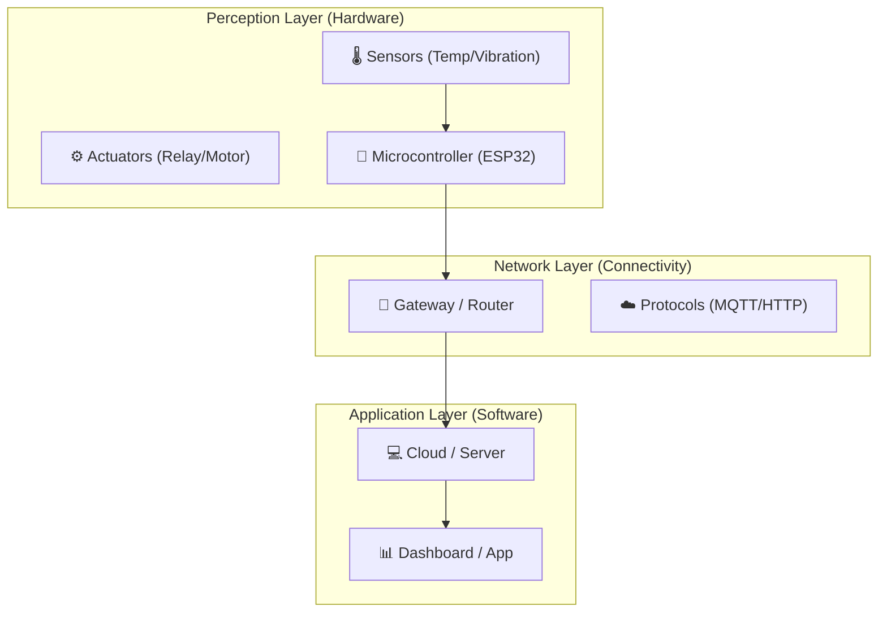

# 💡 IoT Concepts & Architecture

> **บทนำ:** ก่อนจะลงมือบัดกรีวงจร เราต้องเข้าใจก่อนว่า "ระบบ IoT" คืออะไร? มันประกอบด้วยอะไรบ้าง? และทำไม "IoT อุตสาหกรรม" ถึงต้องการมาตรฐานที่สูงกว่าหลอดไฟอัจฉริยะตามบ้าน

---

## 📋 หัวข้อการเรียนรู้ (Modules)

1.  [IoT Architecture Basics](./architecture.md) - โครงสร้าง 3 ชั้นของระบบ IoT
2.  [Industrial Requirements](./industrial-requirements.md) - ความท้าทายในโรงงาน (ฝุ่น, ความร้อน, สัญญาณรบกวน)

---

## 1. The 3-Layer Architecture

โครงสร้างพื้นฐานของระบบ IoT ประกอบด้วย 3 ส่วนหลักที่ทำงานสัมพันธ์กัน:

***Figure 1:*** *Basic IoT Architecture*

* **Perception Layer:** คือส่วนที่เราจะเน้นในหลักสูตรนี้ ประกอบด้วย เซนเซอร์ (ตา/หู), ตัวประมวลผล (สมอง), และ Actuator (แขน/ขา)
* **Network Layer:** ท่อส่งข้อมูล
* **Application Layer:** ส่วนแสดงผลและวิเคราะห์

---

## 2. Sensors & Signal

ข้อมูลเริ่มต้นจากเซนเซอร์ แต่เซนเซอร์ไม่ได้ให้ค่าเป็นตัวเลขดิจิทัลเสมอไป

* **Analog Sensors:** ให้ค่าเป็นแรงดันไฟฟ้าต่อเนื่อง (0-3.3V) เช่น LDR, Thermistor -> ต้องใช้ **ADC (Analog-to-Digital Converter)** แปลง
* **Digital Sensors:** ส่งข้อมูลเป็นรหัส 0/1 ผ่านโปรโตคอล (I2C/SPI) เช่น DHT11, MPU6050

**💡 Concept สำคัญ:** การกำจัดสัญญาณรบกวน (Signal Conditioning) เช่น การใช้ตัวเก็บประจุ (Capacitor) กรองไฟ หรือการเขียนโค้ดหาค่าเฉลี่ย (Moving Average)

---

## 3. Next Steps

* เจาะลึกโครงสร้างระบบใน **[Architecture Basics](./architecture.md)**
* เรียนรู้ว่าโรงงานโหดร้ายแค่ไหนใน **[Industrial Requirements](./industrial-requirements.md)**

---

[🔙 กลับสู่หน้าหลัก](../README.md)

