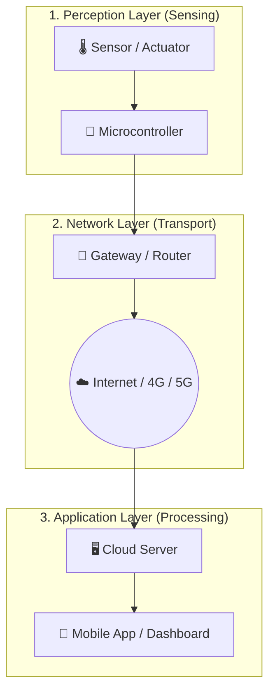
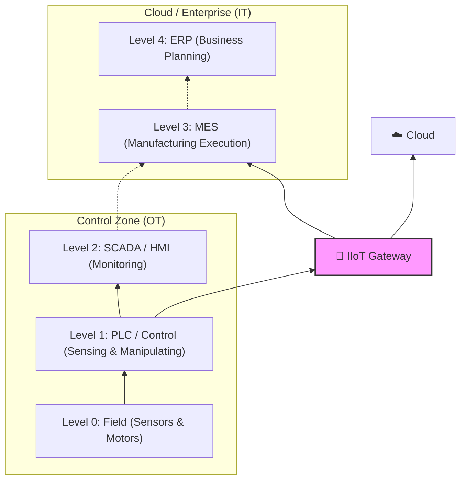

# 🏗️ IoT System Architecture

> **"Architecture is about making important decisions."**
> การเข้าใจสถาปัตยกรรมระบบ ช่วยให้เราตอบคำถามได้ว่า "ทำไมต้องมี Gateway?", "ทำไมไม่ส่งข้อมูลเข้า Cloud โดยตรง?" และ "จะประมวลผลข้อมูลที่ไหนดี?"

---

## 1. The Standard 3-Layer Architecture

โมเดลพื้นฐานที่สุดของ IoT แบ่งหน้าที่ออกเป็น 3 ส่วนชัดเจน เปรียบเสมือนร่างกายมนุษย์

### รายละเอียดแต่ละชั้น:

1. **Perception Layer (ชั้นรับรู้):**
* **หน้าที่:** ตรวจวัดค่าทางกายภาพ (Sense) และควบคุมอุปกรณ์ (Actuate)
* **อุปกรณ์:** ESP32, STM32, Sensors, Barcode Scanner
* **สิ่งที่ต้องคำนึง:** การกินไฟ (Power), ความแม่นยำ (Accuracy)

2. **Network Layer (ชั้นส่งข้อมูล):**
* **หน้าที่:** เป็นท่อส่งข้อมูล เชื่อมต่อระหว่างอุปกรณ์กับ Server
* **เทคโนโลยี:** WiFi, LoRaWAN, NB-IoT, RS-485
* **สิ่งที่ต้องคำนึง:** ระยะทาง (Range), ความเสถียร (Reliability)

3. **Application Layer (ชั้นใช้งาน):**
* **หน้าที่:** แปลงข้อมูลดิบให้เป็นสารสนเทศ กราฟ หรือการแจ้งเตือน
* **เทคโนโลยี:** MQTT Broker, Database, Web Dashboard
* **สิ่งที่ต้องคำนึง:** UX/UI, ความปลอดภัยข้อมูล (Security)

---

## 2. Edge, Fog, and Cloud Computing

ในงานอุตสาหกรรม เราไม่สามารถส่งข้อมูล *ทุกอย่าง* ขึ้น Cloud ได้ (เพราะเปลืองเน็ตและช้า) เราจึงต้องแบ่งระดับการประมวลผล:

| ระดับ | ตำแหน่ง (Location) | ความเร็ว (Latency) | หน้าที่หลัก | ตัวอย่างงาน |
| --- | --- | --- | --- | --- |
| **Edge** | ตัวอุปกรณ์ (MCU/Sensor) | เร็วมาก (< 1ms) | ตัดสินใจทันที, กรองข้อมูลเบื้องต้น | ตัดไฟเมื่อเครื่องจักร Overheat, นับจำนวนชิ้นงาน |
| **Fog** | ในโรงงาน (Gateway/Local Server) | ปานกลาง (10-100ms) | รวบรวมข้อมูลจากหลายเครื่อง, ความปลอดภัย | เก็บ Log การผลิตรายวัน, แปลง Protocol (Modbus -> MQTT) |
| **Cloud** | บน Internet (AWS/Azure) | ช้า (> 100ms) | วิเคราะห์ระยะยาว, เข้าถึงจากทั่วโลก | Dashboard ผู้บริหาร, Machine Learning เทรนโมเดล |

### 🧠 Decision Making Flow

* **Critical Safety:** ทำที่ **Edge** (ห้ามรอเน็ต)
* **Privacy / Local Control:** ทำที่ **Fog** (เน็ตตัดต้องทำงานได้)
* **Big Data / Analytics:** ทำที่ **Cloud**

---

## 3. The Industrial IoT (IIoT) Architecture

เมื่อนำ IoT มาใช้ในโรงงาน เรามักอ้างอิง **ISA-95 (The Purdue Model)** หรือ Automation Pyramid เพื่อให้ IT (โปรแกรมเมอร์) คุยกับ OT (วิศวกรโรงงาน) รู้เรื่อง

* **Traditional:** ข้อมูลจะไหลขึ้นทีละขั้น (0 -> 1 -> 2 -> 3 -> 4) ทำให้ช้าและข้อมูลตกหล่น
* **Modern IIoT:** เราใช้ **IoT Gateway** (สีชมพู) เจาะทะลุเพื่อดึงข้อมูลจาก Level 1 (PLC) ส่งตรงไป Level 3 หรือ Cloud ได้เลย เพื่อการวิเคราะห์ที่รวดเร็ว (Bypassing the hierarchy)

---

## 4. Key Design Patterns

รูปแบบการต่อวงจรที่พบบ่อย:

### 4.1 Direct Connectivity (Consumer Style)

* **Device -> WiFi -> Cloud**
* *ข้อดี:* ง่าย ราคาถูก
* *ข้อเสีย:* กินไฟ, ถ้าเน็ตหลุดคือจบ, อุปกรณ์เยอะๆ WiFi ล่ม

### 4.2 Gateway Aggregation (Industrial Style)

* **Device (Nodes) -> [Local Protocol] -> Gateway -> [Internet] -> Cloud**
* *Nodes:* ใช้ LoRa, BLE, หรือ RS-485 (ประหยัดไฟ/ทนทาน)
* *Gateway:* เป็นตัวเดียวที่ต่อเน็ตและเสียบปลั๊ก
* *ข้อดี:* เสถียร, เปลี่ยนเทคโนโลยีง่าย, เน็ตหลุด Gateway ยังเก็บข้อมูลให้

---

[🔙 กลับสู่หน้า IoT Concepts](./README.md)

