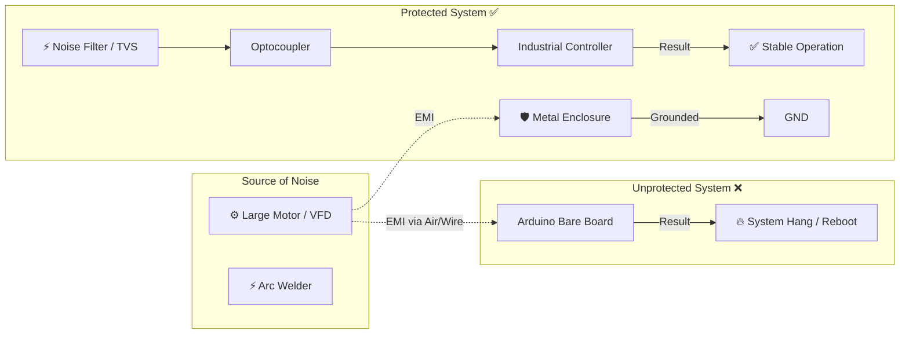

# 🏭 Industrial Requirements & Challenges

> **"In the factory, anything that can go wrong, will go wrong."**
> การนำบอร์ด Arduino หรือ Raspberry Pi ใส่กล่องพลาสติกไปวางในโรงงาน มักจะมีอายุขัยไม่เกิน 1 สัปดาห์ บทเรียนนี้จะมาไขคำตอบว่าทำไม และต้องทำอย่างไรให้อุปกรณ์ของเรา "อึด ถึก ทน"

---

## 1. The Harsh Environment (สภาพแวดล้อมที่โหดร้าย)

โรงงานไม่ใช่ห้องแอร์ที่สะอาดและเงียบสงบ แต่มันเต็มไปด้วยศัตรูของอิเล็กทรอนิกส์ 3 ประการ:

### 1.1 Temperature & Humidity (ความร้อนและความชื้น)
* **Consumer Grade (0°C ถึง 40°C):** ชิปทั่วไปทำงานได้แค่ในอุณหภูมิห้อง
* **Industrial Grade (-40°C ถึง 85°C):** ในตู้ Control เครื่องจักร อุณหภูมิอาจพุ่งสูงถึง 60°C ตลอด 24 ชม. ทำให้ชิปเสื่อมสภาพเร็ว หรือค่า Clock เพี้ยน
* **Moisture:** ความชื้นทำให้เกิดสนิมที่ขาอุปกรณ์ (Corrosion) และทำให้เกิดการลัดวงจร (Short Circuit)

### 1.2 Dust & Particles (ฝุ่นละออง)
* **Conductive Dust:** ฝุ่นในโรงงานเหล็กหรือคาร์บอน "นำไฟฟ้าได้" ถ้ามันเข้าไปเกาะบนบอร์ด = ช็อตทันที
* **Chemicals:** ไอระเหยของสารเคมีหรือน้ำมัน สามารถกัดกร่อนลายทองแดงบน PCB ได้

### 1.3 Vibration (แรงสั่นสะเทือน)
* เครื่องปั๊มขนาดใหญ่ทำให้พื้นสั่นตลอดเวลา
* **ผลลัพธ์:** สายไฟหลวม, ขั้วต่อ (Connector) หลุด, ตะกั่วบัดกรีร้าว (Solder crack)

---

## 2. Electrical Noise (สัญญาณรบกวนทางไฟฟ้า)

นี่คือ "ฆาตกรเงียบ" ที่ทำให้นักพัฒนา IoT มือใหม่ตกม้าตายมากที่สุด

### ประเภทของสัญญาณรบกวน (EMI/EMC)
1.  **Conducted Noise (มาตามสายไฟ):** เกิดจาก Inverter (VFD) หรือการเปิด/ปิดมอเตอร์ใหญ่ๆ ทำให้ไฟกระชาก (Surge) หรือไฟตกวูบ
2.  **Radiated Noise (มาทางอากาศ):** คลื่นแม่เหล็กไฟฟ้าจากตู้เชื่อม หรือวิทยุสื่อสารกำลังส่งสูง สามารถเหนี่ยวนำให้ค่า Sensor เพี้ยนได้

### Diagram: การป้องกัน Noise

---

## 3. Standards & Solutions (มาตรฐานและทางแก้)

เมื่อต้องออกแบบอุปกรณ์ IIoT เราต้องปฏิบัติตามมาตรฐานเหล่านี้:

### 3.1 IP Ratings (Ingress Protection)

ตัวเลข 2 หลักที่บอกระดับการกันฝุ่นและน้ำ (เช่น IP65, IP67)

| Rating | กันฝุ่น (หลักแรก) | กันน้ำ (หลักสอง) | การใช้งาน |
| --- | --- | --- | --- |
| **IP20** | กันนิ้วแหย่ | ไม่กันน้ำ | ใช้ในตู้ Control (Indoor) |
| **IP54** | กันฝุ่นบ้าง | กันละอองน้ำ | โรงงานทั่วไป |
| **IP67** | กันฝุ่นสมบูรณ์ | จุ่มน้ำได้ | กลางแจ้ง / ล้างด้วยน้ำแรงดันสูง |

### 3.2 Galvanic Isolation (การแยกกราวด์)

**กฎเหล็ก:** ห้ามต่อสายสัญญาณจากเครื่องจักร เข้าขา MCU โดยตรง!

* ต้องใช้ **Optocoupler** (ใช้แสงส่งสัญญาณ) เพื่อแยกวงจรไฟฟ้าออกจากกันอย่างเด็ดขาด
* ถ้าไฟกระชาก 220V เข้ามาทาง Sensor -> Opto พัง แต่ MCU (สมอง) รอด

### 3.3 Hardware Watchdog

* ในโรงงาน เครื่องอาจต้องเปิดทิ้งไว้ 5 ปีโดยไม่มีคนกด Reset
* ต้องมีวงจร **Watchdog Timer (WDT)** ภายนอก คอยจับตาดู ถ้า Software ค้าง WDT จะตบให้ตื่น (Hardware Reset) โดยอัตโนมัติ

---

## 4. Design Checklist for IIoT Devices

ก่อนนำบอร์ดไปติดตั้ง ให้ถามตัวเองด้วยเช็คลิสต์นี้:

* [ ] **Power Supply:** ใช้วงจร Switching ที่มีคุณภาพ มี C กรองสัญญาณรบกวน และรองรับ Input กว้าง (เช่น 9-36V) หรือไม่?
* [ ] **Protection:** ขา Input/Output มี TVS Diode หรือ Optocoupler ป้องกันไฟกระชากหรือไม่?
* [ ] **Connectors:** ใช้ Terminal Block แบบขันสกรู หรือ Connector ที่มีตัวล็อกกันสั่นหรือไม่? (ห้ามใช้สาย Jumper เสียบ!)
* [ ] **Enclosure:** กล่องใส่ได้มาตรฐาน IP Rating ตามจุดติดตั้งหรือไม่?

---

[🔙 กลับสู่หน้า IoT Concepts](./README.md)

