# 💻 Software & Programming for Embedded Systems

> **บทนำ:** "Hardware คือร่างกาย Firmware คือจิตวิญญาณ" การเขียนโค้ดสำหรับงานอุตสาหกรรม เราห้ามใช้คำสั่ง `delay(1000)` เด็ดขาด! เพราะการสั่งให้ CPU หยุดรอเฉยๆ 1 วินาที อาจหมายถึงการพลาดสัญญาณฉุกเฉินจากเซนเซอร์

---

## 📋 หัวข้อการเรียนรู้ (Modules)

1.  [Real-time OS (RTOS)](./rtos.md) - การเขียนโปรแกรมแบบ Multitasking (ทำหลายอย่างพร้อมกัน)
2.  [Firmware Structure & FSM](./firmware-structure.md) - โครงสร้างโค้ดที่ดีและการจัดการสถานะ (State Machine)

---

## 1. Super Loop vs Multitasking

### The "Super Loop" (Arduino Style)
วิธีเขียนแบบดั้งเดิม คือทำทีละอย่างวนไปเรื่อยๆ

```cpp
void loop() {
  readSensor(); // กินเวลา 50ms
  updateDisplay(); // กินเวลา 100ms
  checkWiFi(); // กินเวลา 2000ms (!!!) <--- ปัญหาเกิดตรงนี้
  // ระหว่างที่เช็ค WiFi ระบบจะเป็นอัมพาต กดปุ่มก็ไม่ติด
}

```

### The "Multitasking" (RTOS Style)

แบ่งงานออกเป็น **Tasks** อิสระ CPU จะสลับไปทำงานต่างๆ ให้เองอย่างรวดเร็ว

```mermaid
graph TD
    CPU((CPU Scheduler))
    
    Task1["Task 1: อ่าน Sensor<br/>(Priority: High)"]
    Task2["Task 2: คุม Motor<br/>(Priority: High)"]
    Task3["Task 3: ส่ง WiFi<br/>(Priority: Low)"]
    
    CPU -->|10ms| Task1
    CPU -->|10ms| Task2
    CPU -->|Slice| Task3


```



---

## 2. Tools: PlatformIO vs Arduino IDE

* **Arduino IDE:** เหมาะกับผู้เริ่มต้น กดปุ่มเดียวจบ แต่จัดการไฟล์ยาก ไม่มี Auto-complete
* **PlatformIO (บน VS Code):** (แนะนำสำหรับมืออาชีพ)
* จัดการ Library อัตโนมัติ (ผ่าน `platformio.ini`)
* รองรับการแบ่งไฟล์ `.h` / `.cpp` ได้ดี
* มี Debugger (หยุดดูค่าตัวแปรขณะรันได้)


---

## 3. Next Steps

* เรียนรู้วิธีแบ่งร่าง CPU ให้ทำงานพร้อมกันใน **[RTOS](./rtos.md)**
* เขียนโค้ดให้เป็นระเบียบด้วย State Machine ใน **[Firmware Structure](./firmware-structure.md)**

---

[🔙 กลับสู่หน้าหลัก](../README.md)
