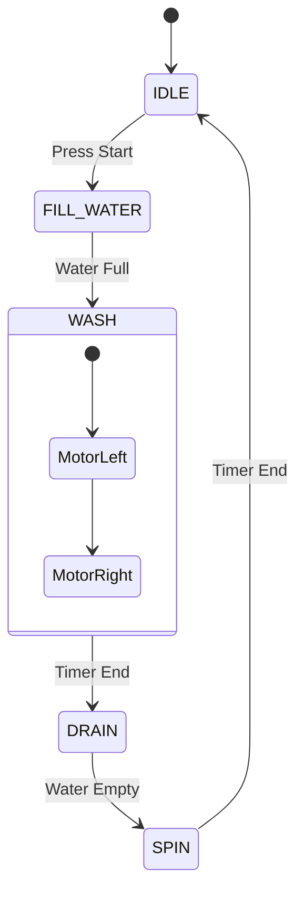

# 🏗️ Firmware Structure & Finite State Machine

> โค้ดที่ "ทำงานได้" กับ โค้ดที่ "ดี" ต่างกันที่ **"โครงสร้าง"** โค้ดที่ดีต้องแก้ไขง่าย และเรารู้เสมอว่าตอนนี้ระบบกำลังทำอะไรอยู่

---

## 1. Finite State Machine (FSM)

เครื่องจักรในโรงงานไม่ได้ทำงานมั่วๆ แต่มันมี "สถานะ" ที่ชัดเจน FSM ช่วยกำจัดบั๊กประเภท "เครื่องทำงานซ้อนกัน"

### Diagram: Washing Machine Logic



### การเขียน FSM ด้วย Switch-Case

```cpp
enum State { IDLE, FILL_WATER, WASH, ERROR };
State currentState = IDLE;

void runMachine() {
  switch (currentState) {
    case IDLE:
      if (btnStart) currentState = FILL_WATER;
      break;
    case FILL_WATER:
      openValve();
      if (waterFull) currentState = WASH;
      break;
    // ...
  }
}

```

---

## 2. Modular Programming

อย่าเขียนทุกอย่างในไฟล์เดียว (`main.cpp` ยาว 5000 บรรทัด = นรก)
ให้แยกไฟล์ตามหน้าที่:

* `sensor_manager.cpp` / `.h` -> ดูแลการอ่านค่า Sensor
* `wifi_manager.cpp` / `.h` -> ดูแลการเชื่อมต่อและ Reconnect
* `mqtt_manager.cpp` / `.h` -> ดูแลการส่งข้อมูล

---

## 3. OTA (Over-The-Air) Updates

ฟีเจอร์ไม้ตายของ IoT คือการอัปเดตเฟิร์มแวร์ได้โดยไม่ต้องไปหน้างาน

* **Concept:** อุปกรณ์โหลดไฟล์ `.bin` ใหม่จาก Server -> เก็บลง Partition ว่าง -> สลับ Partition -> Reboot
* **Tools:** ArduinoOTA (ในวง LAN), AWS IoT Jobs (ผ่าน Cloud)

---

[🔙 กลับสู่หน้า Software](./README.md)
